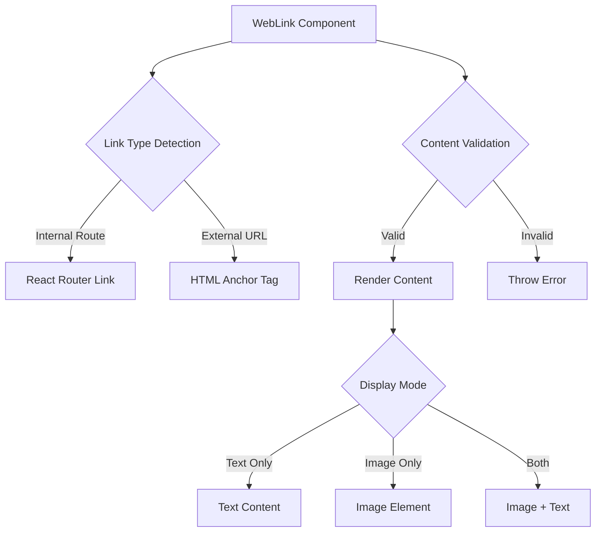
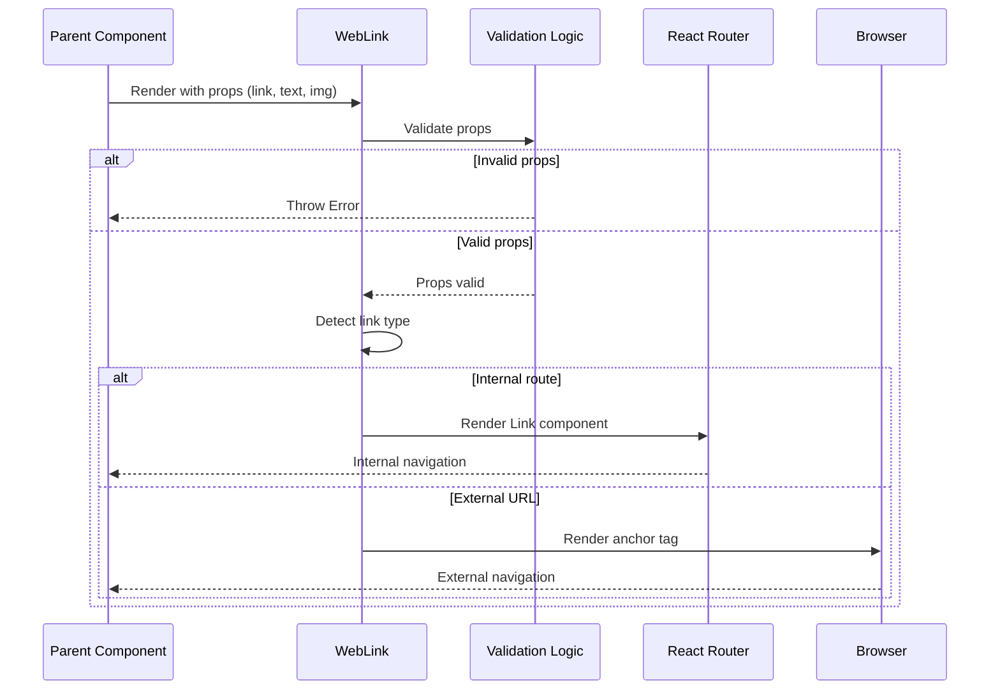

# Design Document: Enhanced WebLink Component

## Overview

The enhanced WebLink component provides flexible navigation for both internal portfolio routes and external websites. It supports multiple content display modes (text only, image only, or both) while enforcing validation rules to ensure meaningful links. The component intelligently detects link types and renders appropriate HTML elements (React Router Link for internal navigation, anchor tags for external URLs).

## Architecture



## Main Algorithm/Workflow



## Components and Interfaces

### WebLink Component

**Purpose**: Provide unified navigation interface for internal and external links with flexible content display

**Props Interface**:
```javascript
{
  link: string,      // Required: URL or route path
  text: string,      // Optional: Link text content
  img: string        // Optional: Image source URL
}
```

**Responsibilities**:
- Validate that link is provided and either text or img exists
- Detect whether link is internal (route) or external (URL)
- Render appropriate navigation element (Link vs anchor)
- Apply consistent styling classes
- Handle image alt text appropriately

## Data Models

### Props Model

```javascript
{
  link: string,      // Required, non-empty string
  text: string,      // Optional, can be undefined or empty
  img: string        // Optional, can be undefined or empty
}
```

**Validation Rules**:
- `link` must be a non-empty string (required)
- At least one of `text` or `img` must be provided and non-empty
- Both `text` and `img` can be provided simultaneously
- `text` serves as alt text for image when both are present

### Link Type Detection

```javascript
{
  isExternal: boolean,    // true if link starts with http://, https://, or //
  isInternal: boolean     // true if link is a relative path or starts with /
}
```

## Key Functions with Formal Specifications

### Function 1: validateProps()

```javascript
function validateProps(link, text, img)
```

**Preconditions:**
- Function receives three parameters (may be undefined)

**Postconditions:**
- Throws Error if `link` is falsy or empty string
- Throws Error if both `text` and `img` are falsy or empty strings
- Returns void if validation passes
- No side effects on input parameters

**Loop Invariants:** N/A (no loops)

### Function 2: isExternalLink()

```javascript
function isExternalLink(link)
```

**Preconditions:**
- `link` is a non-empty string (validated by validateProps)

**Postconditions:**
- Returns boolean value
- Returns `true` if link starts with 'http://', 'https://', or '//'
- Returns `false` for all other cases (internal routes)
- No mutations to input parameter

**Loop Invariants:** N/A (no loops)

### Function 3: renderContent()

```javascript
function renderContent(text, img)
```

**Preconditions:**
- At least one of `text` or `img` is truthy (validated by validateProps)

**Postconditions:**
- Returns JSX element(s)
- If both `text` and `img` exist: returns img element followed by text
- If only `img` exists: returns img element with empty alt text
- If only `text` exists: returns text node
- Image elements always have className="web-link-image"

**Loop Invariants:** N/A (no loops)

## Algorithmic Pseudocode

### Main Rendering Algorithm

```pascal
ALGORITHM renderWebLink(props)
INPUT: props containing {link, text, img}
OUTPUT: JSX element (Link or anchor)

BEGIN
  // Step 1: Validate props
  CALL validateProps(props.link, props.text, props.img)
  
  // Step 2: Determine link type
  isExternal ← isExternalLink(props.link)
  
  // Step 3: Prepare content
  content ← renderContent(props.text, props.img)
  
  // Step 4: Render appropriate element
  IF isExternal THEN
    RETURN <a href={props.link} 
              className="web-link" 
              target="_blank" 
              rel="noopener noreferrer">
             {content}
           </a>
  ELSE
    RETURN <Link to={props.link} 
                 className="web-link">
             {content}
           </Link>
  END IF
END
```

**Preconditions:**
- props object is provided
- props contains link property

**Postconditions:**
- Returns valid JSX element
- External links open in new tab with security attributes
- Internal links use React Router navigation
- All links have "web-link" className

**Loop Invariants:** N/A (no loops in main algorithm)

### Validation Algorithm

```pascal
ALGORITHM validateProps(link, text, img)
INPUT: link (string), text (string or undefined), img (string or undefined)
OUTPUT: void or throws Error

BEGIN
  // Check link requirement
  IF link IS falsy OR link IS empty string THEN
    THROW Error("WebLink requires a 'link' prop")
  END IF
  
  // Check content requirement
  hasText ← text IS truthy AND text IS NOT empty string
  hasImg ← img IS truthy AND img IS NOT empty string
  
  IF NOT hasText AND NOT hasImg THEN
    THROW Error("WebLink requires either 'text' or 'img' prop")
  END IF
  
  // Validation passed
  RETURN void
END
```

**Preconditions:**
- Function receives three parameters (may be undefined or null)

**Postconditions:**
- Throws descriptive Error if validation fails
- Returns void if all validations pass
- No side effects on input parameters

**Loop Invariants:** N/A (no loops)

### Link Type Detection Algorithm

```pascal
ALGORITHM isExternalLink(link)
INPUT: link (non-empty string)
OUTPUT: boolean

BEGIN
  // Check for absolute URL protocols
  IF link STARTS WITH "http://" THEN
    RETURN true
  END IF
  
  IF link STARTS WITH "https://" THEN
    RETURN true
  END IF
  
  IF link STARTS WITH "//" THEN
    RETURN true
  END IF
  
  // All other cases are internal routes
  RETURN false
END
```

**Preconditions:**
- link is a non-empty string (guaranteed by validateProps)

**Postconditions:**
- Returns boolean value
- true indicates external URL requiring anchor tag
- false indicates internal route requiring React Router Link
- No side effects

**Loop Invariants:** N/A (no loops)

### Content Rendering Algorithm

```pascal
ALGORITHM renderContent(text, img)
INPUT: text (string or undefined), img (string or undefined)
OUTPUT: JSX content

BEGIN
  // At least one is truthy (guaranteed by validateProps)
  
  IF img IS truthy AND text IS truthy THEN
    // Both image and text
    RETURN <>
             
             {text}
           </>
  END IF
  
  IF img IS truthy THEN
    // Image only
    RETURN 
  END IF
  
  // Text only (guaranteed by validation)
  RETURN text
END
```

**Preconditions:**
- At least one of text or img is truthy (guaranteed by validateProps)

**Postconditions:**
- Returns valid JSX content
- Images always have className="web-link-image"
- Image-only mode uses empty alt text
- Image+text mode uses text as alt attribute
- Text-only mode returns plain text node

**Loop Invariants:** N/A (no loops)

## Example Usage

```javascript
// Example 1: Internal navigation with text only
<WebLink 
  link="/purger" 
  text="View Purger Project" 
/>

// Example 2: External link with text only
<WebLink 
  link="https://github.com/username/repo" 
  text="View on GitHub" 
/>

// Example 3: Internal navigation with image and text
<WebLink 
  link="/dodgewest" 
  text="Dodge West" 
  img="/images/DodgeWest/thumbnail.png" 
/>

// Example 4: External link with image only
<WebLink 
  link="https://twitter.com/username" 
  img="/images/icons/twitter.png" 
/>

// Example 5: Error case - no link
<WebLink text="Invalid" />
// Throws: Error("WebLink requires a 'link' prop")

// Example 6: Error case - no content
<WebLink link="/home" />
// Throws: Error("WebLink requires either 'text' or 'img' prop")
```

## Correctness Properties

*A property is a characteristic or behavior that should hold true across all valid executions of a system-essentially, a formal statement about what the system should do. Properties serve as the bridge between human-readable specifications and machine-verifiable correctness guarantees.*

### Property 1: Link Requirement

*For any* props passed to WebLink, if the link prop is missing or empty, then an Error must be thrown before rendering.

**Validates: Requirements 1.3, 1.4**

### Property 2: Content Requirement

*For any* props passed to WebLink, if both text and img props are missing or empty, then an Error must be thrown before rendering.

**Validates: Requirements 2.4, 2.5**

### Property 3: External Link Detection

*For any* link string starting with 'http://', 'https://', or '//', the link must be classified as an External_URL.

**Validates: Requirements 3.1, 3.2, 3.3**

### Property 4: Internal Link Detection

*For any* link string not starting with 'http://', 'https://', or '//', the link must be classified as an Internal_Route.

**Validates: Requirements 3.4**

### Property 5: External Link Rendering

*For any* valid props where the link is classified as an External_URL, the rendered element must be an HTML anchor tag with href equal to the link prop, target="_blank", and rel="noopener noreferrer".

**Validates: Requirements 4.1, 4.3, 5.1, 5.2**

### Property 6: Internal Link Rendering

*For any* valid props where the link is classified as an Internal_Route, the rendered element must be a React Router Link component with to prop equal to the link prop, and no target or rel attributes.

**Validates: Requirements 4.2, 4.4, 5.3**

### Property 7: Styling Consistency

*For any* valid props, the rendered Link_Element must have className="web-link".

**Validates: Requirements 6.1**

### Property 8: Text Content Display

*For any* valid props where text prop is provided, the rendered output must contain the text content.

**Validates: Requirements 2.1**

### Property 9: Image Element Rendering

*For any* valid props where img prop is provided, the rendered output must contain an img element with src equal to the img prop, and className="web-link-image".

**Validates: Requirements 2.2, 6.2, 7.3**

### Property 10: Combined Content Display

*For any* valid props where both text and img props are provided, the rendered output must contain both the image element and text content, with the image appearing before the text.

**Validates: Requirements 2.3, 8.1**

### Property 11: Alt Text with Both Content

*For any* valid props where both text and img props are provided, the img element's alt attribute must equal the text prop value.

**Validates: Requirements 7.1**

### Property 12: Alt Text with Image Only

*For any* valid props where img prop is provided but text prop is not, the img element's alt attribute must be an empty string.

**Validates: Requirements 7.2**

## Error Handling

### Error Scenario 1: Missing Link Prop

**Condition**: Component rendered without `link` prop or with empty string
**Response**: Throw Error with message "WebLink requires a 'link' prop"
**Recovery**: Parent component must provide valid link prop

### Error Scenario 2: Missing Content Props

**Condition**: Component rendered without both `text` and `img` props (or both are empty strings)
**Response**: Throw Error with message "WebLink requires either 'text' or 'img' prop"
**Recovery**: Parent component must provide at least one content prop

### Error Scenario 3: Invalid Image Source

**Condition**: `img` prop points to non-existent or inaccessible image
**Response**: Browser displays broken image icon, component continues to function
**Recovery**: Graceful degradation - text content still displays if provided

### Error Scenario 4: Malformed URL

**Condition**: External link has invalid URL format
**Response**: Browser handles navigation error (component renders normally)
**Recovery**: User sees browser error page, can navigate back

## Testing Strategy

### Unit Testing Approach

Test the component in isolation using React Testing Library and Vitest:

**Key Test Cases**:
1. Renders internal link with text only
2. Renders external link with text only
3. Renders internal link with image only
4. Renders external link with image only
5. Renders internal link with both image and text
6. Renders external link with both image and text
7. Throws error when link prop is missing
8. Throws error when link prop is empty string
9. Throws error when both text and img are missing
10. Throws error when both text and img are empty strings
11. Applies correct className to link element
12. Applies correct className to image element
13. External links have target="_blank" and rel="noopener noreferrer"
14. Internal links use React Router Link component
15. Image alt text equals text prop when both provided
16. Image alt text is empty when only image provided
17. Detects http:// URLs as external
18. Detects https:// URLs as external
19. Detects // URLs as external
20. Detects relative paths as internal
21. Detects absolute paths (starting with /) as internal

**Coverage Goals**: 100% line, branch, and function coverage

### Property-Based Testing Approach

Use fast-check library to generate random valid and invalid prop combinations:

**Property Test Library**: fast-check

**Properties to Test**:
1. **Valid Props Always Render**: For any valid combination of (link, text, img), component renders without throwing
2. **Missing Link Always Errors**: For any combination of (text, img) without link, component throws error
3. **Missing Content Always Errors**: For any link without text or img, component throws error
4. **External Detection Consistency**: For any URL starting with http://, https://, or //, component renders anchor tag
5. **Internal Detection Consistency**: For any path not starting with http://, https://, or //, component renders Link
6. **Styling Invariant**: For any valid props, rendered element has "web-link" className
7. **Image Styling Invariant**: For any valid props with img, rendered img has "web-link-image" className

### Integration Testing Approach

Test component within actual portfolio pages:

1. Verify navigation works correctly on Home page
2. Verify external links open in new tabs
3. Verify internal links navigate without page reload
4. Verify styling integrates with existing CSS
5. Test with actual project images and routes
6. Verify accessibility with screen readers

## Performance Considerations

- Component is lightweight with minimal computational overhead
- Link type detection uses simple string prefix checks (O(1) complexity)
- No state management or side effects
- React Router Link provides optimized internal navigation
- External links use native browser navigation

## Security Considerations

- External links must include `rel="noopener noreferrer"` to prevent:
  - Tabnabbing attacks (noopener)
  - Referrer information leakage (noreferrer)
- No user-generated content is rendered without escaping (React handles this)
- Image sources should be validated at data layer (not component responsibility)
- External URLs are not sanitized (assumed to come from trusted sources)

## Dependencies

- **react**: Core React library for component creation
- **react-router-dom**: Provides Link component for internal navigation
- **prop-types** (optional): Runtime prop validation for development

No additional dependencies required.
