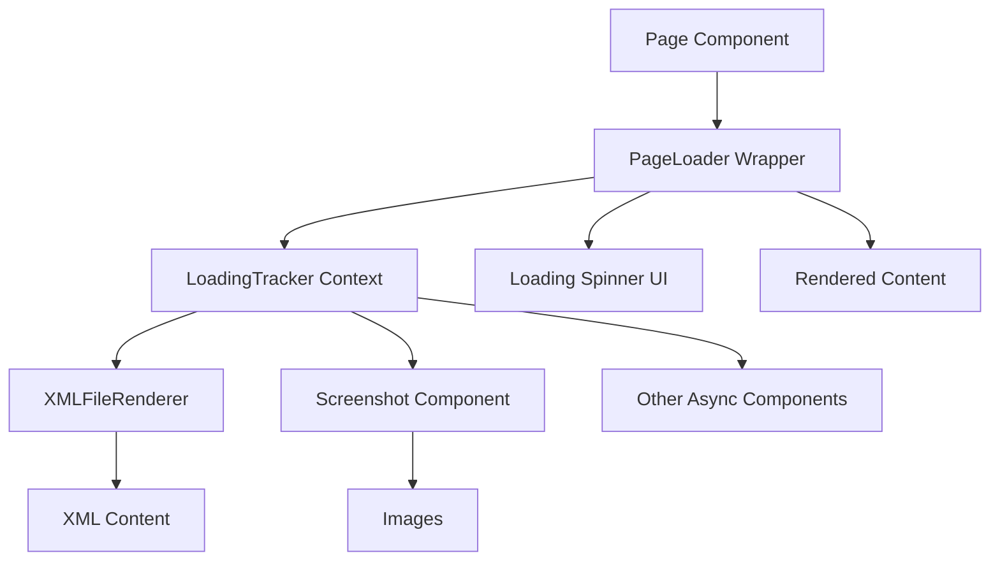
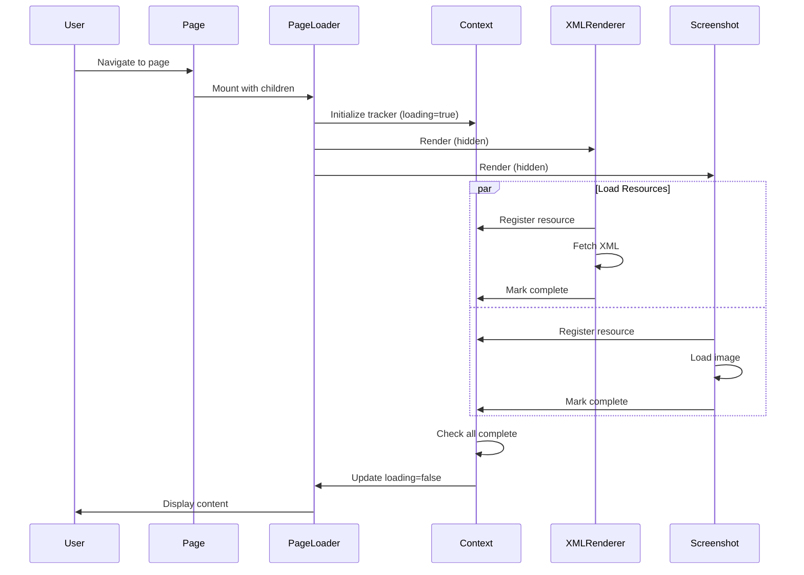

# Design Document: Page Loading States

## Overview

This feature implements loading states for all JSX page components to ensure content is only displayed once fully loaded. Currently, XMLFileRenderer components and images render progressively as they load, creating a disjointed user experience. The solution introduces a PageLoader wrapper component that tracks all async resources (XML files, images) on a page and displays content only when everything is ready. This provides a smoother, more professional user experience by preventing partial content flashes and layout shifts.

## Architecture



The architecture uses React Context to track loading states across multiple components within a page. The PageLoader wrapper provides the context and manages the overall loading state, while individual components (XMLFileRenderer, Screenshot) register themselves and report when they're ready.

## Sequence Diagrams

### Page Load Flow



## Components and Interfaces

### Component 1: PageLoader

**Purpose**: Wrapper component that manages page-level loading state and displays content only when all resources are loaded.

**Interface**:
```javascript
function PageLoader({ 
  children,
  loadingComponent = <DefaultLoadingSpinner />,
  minLoadingTime = 300
})
```

**Props**:
- `children`: React nodes to render once loading is complete
- `loadingComponent`: Optional custom loading UI (defaults to spinner)
- `minLoadingTime`: Minimum time (ms) to show loading state to prevent flashing

**Responsibilities**:
- Provide LoadingTracker context to child components
- Track overall loading state
- Render loading UI or content based on state
- Enforce minimum loading time to prevent UI flashing

### Component 2: LoadingTrackerContext

**Purpose**: React Context that manages registration and tracking of async resources across the component tree.

**Interface**:
```javascript
const LoadingTrackerContext = createContext({
  registerResource: (id) => {},
  markResourceComplete: (id) => {},
  isLoading: true
});

function LoadingTrackerProvider({ children })
```

**State**:
- `pendingResources`: Set of resource IDs that are still loading
- `isLoading`: Boolean indicating if any resources are pending

**Responsibilities**:
- Maintain set of pending resource IDs
- Provide registration and completion callbacks
- Calculate overall loading state
- Notify consumers when loading state changes

### Component 3: Enhanced XMLFileRenderer

**Purpose**: Modified XMLFileRenderer that integrates with LoadingTracker to report its loading state.

**Interface**:
```javascript
function XMLFileRenderer({ 
  fileName, 
  className,
  trackLoading = true 
})
```

**Changes from Current**:
- Consume LoadingTrackerContext
- Register unique resource ID on mount
- Mark complete when content is loaded
- Support opt-out via `trackLoading` prop

### Component 4: Enhanced Screenshot

**Purpose**: Modified Screenshot component that tracks image loading state.

**Interface**:
```javascript
function Screenshot({ 
  src, 
  alt, 
  size = 600, 
  padding = 10,
  trackLoading = true 
})
```

**Changes from Current**:
- Consume LoadingTrackerContext
- Register unique resource ID on mount
- Use `onLoad` event to mark complete
- Handle `onError` for failed loads
- Support opt-out via `trackLoading` prop

## Data Models

### LoadingState

```javascript
{
  pendingResources: Set<string>,  // Set of resource IDs still loading
  isLoading: boolean,              // Computed: pendingResources.size > 0
  loadingStartTime: number         // Timestamp when loading started
}
```

**Validation Rules**:
- `pendingResources` must be a Set
- `isLoading` must match `pendingResources.size > 0`
- `loadingStartTime` must be a valid timestamp

### ResourceRegistration

```javascript
{
  id: string,        // Unique identifier for the resource
  type: string,      // 'xml' | 'image' | 'other'
  status: string     // 'pending' | 'complete' | 'error'
}
```

**Validation Rules**:
- `id` must be unique within the page context
- `type` must be one of the allowed values
- `status` transitions: pending → (complete | error)

## Algorithmic Pseudocode

### Main Loading Management Algorithm

```javascript
// PageLoader component algorithm
function PageLoader({ children, loadingComponent, minLoadingTime = 300 }) {
  // PRECONDITION: children is valid React node
  // PRECONDITION: minLoadingTime >= 0
  
  const [pendingResources, setPendingResources] = useState(new Set());
  const [loadingStartTime] = useState(Date.now());
  const [canDisplay, setCanDisplay] = useState(false);
  
  // INVARIANT: pendingResources contains only registered, incomplete resources
  const isLoading = pendingResources.size > 0;
  
  // Register a new resource that needs to load
  const registerResource = useCallback((id) => {
    // PRECONDITION: id is non-empty string
    setPendingResources(prev => {
      const next = new Set(prev);
      next.add(id);
      return next;
      // POSTCONDITION: id is in pendingResources
    });
  }, []);
  
  // Mark a resource as complete
  const markResourceComplete = useCallback((id) => {
    // PRECONDITION: id is non-empty string
    setPendingResources(prev => {
      const next = new Set(prev);
      next.delete(id);
      return next;
      // POSTCONDITION: id is not in pendingResources
    });
  }, []);
  
  // Effect: Handle transition from loading to ready
  useEffect(() => {
    if (!isLoading && !canDisplay) {
      // PRECONDITION: All resources are loaded
      const elapsedTime = Date.now() - loadingStartTime;
      const remainingTime = Math.max(0, minLoadingTime - elapsedTime);
      
      // Enforce minimum loading time
      const timer = setTimeout(() => {
        setCanDisplay(true);
        // POSTCONDITION: Content will be displayed
      }, remainingTime);
      
      return () => clearTimeout(timer);
    }
  }, [isLoading, canDisplay, loadingStartTime, minLoadingTime]);
  
  const contextValue = {
    registerResource,
    markResourceComplete,
    isLoading
  };
  
  // POSTCONDITION: Returns loading UI if not ready, content if ready
  return (
    <LoadingTrackerContext.Provider value={contextValue}>
      {canDisplay ? children : loadingComponent}
    </LoadingTrackerContext.Provider>
  );
}
```

**Preconditions**:
- `children` is a valid React node
- `minLoadingTime` is non-negative number
- Component is mounted in React tree

**Postconditions**:
- Context is provided to all children
- Loading UI is shown until all resources complete AND minimum time elapsed
- Content is shown only when `canDisplay` is true

**Loop Invariants**:
- `pendingResources` Set contains only IDs of resources that have registered but not completed
- `isLoading` always equals `pendingResources.size > 0`

### Resource Registration Algorithm

```javascript
// XMLFileRenderer integration algorithm
function XMLFileRenderer({ fileName, className, trackLoading = true }) {
  // PRECONDITION: fileName is non-empty string
  
  const [content, setContent] = useState(null);
  const [loading, setLoading] = useState(true);
  const [error, setError] = useState(null);
  const { registerResource, markResourceComplete } = useContext(LoadingTrackerContext);
  const resourceId = useRef(`xml-${fileName}-${Math.random()}`).current;
  
  useEffect(() => {
    // Register this resource with the page loader
    if (trackLoading) {
      registerResource(resourceId);
      // POSTCONDITION: resourceId is in pendingResources
    }
    
    let isMounted = true;
    
    async function loadContent() {
      try {
        setLoading(true);
        setError(null);
        
        const xmlString = await fetchXMLFile(fileName);
        const reactElements = parseXMLToReact(xmlString);
        
        if (isMounted) {
          setContent(reactElements);
          setLoading(false);
          
          // Mark resource as complete
          if (trackLoading) {
            markResourceComplete(resourceId);
            // POSTCONDITION: resourceId is not in pendingResources
          }
        }
      } catch (err) {
        if (isMounted) {
          setError(err);
          setLoading(false);
          
          // Mark as complete even on error to unblock page
          if (trackLoading) {
            markResourceComplete(resourceId);
          }
        }
      }
    }
    
    loadContent();
    
    return () => {
      isMounted = false;
      // Cleanup: ensure resource is marked complete on unmount
      if (trackLoading) {
        markResourceComplete(resourceId);
      }
    };
  }, [fileName, trackLoading, registerResource, markResourceComplete, resourceId]);
  
  // Render content (visibility controlled by PageLoader)
  if (loading) {
    return <div className={className}>Loading...</div>;
  }
  
  if (error) {
    return <div className={className}>Error loading content</div>;
  }
  
  return content ? <div className={className}>{content}</div> : null;
}
```

**Preconditions**:
- `fileName` is non-empty string
- LoadingTrackerContext is available in component tree
- `fetchXMLFile` and `parseXMLToReact` functions are available

**Postconditions**:
- Resource is registered on mount if `trackLoading` is true
- Resource is marked complete when content loads or errors
- Resource is marked complete on unmount (cleanup)
- Component renders appropriate UI based on loading/error/success state

**Loop Invariants**: N/A (async operation, no loops)

### Image Loading Algorithm

```javascript
// Screenshot component with loading tracking
function Screenshot({ src, alt, size = 600, padding = 10, trackLoading = true }) {
  // PRECONDITION: src is non-empty string
  
  const { registerResource, markResourceComplete } = useContext(LoadingTrackerContext);
  const resourceId = useRef(`img-${src}-${Math.random()}`).current;
  const [imageLoaded, setImageLoaded] = useState(false);
  
  useEffect(() => {
    // Register this image with the page loader
    if (trackLoading) {
      registerResource(resourceId);
      // POSTCONDITION: resourceId is in pendingResources
    }
    
    return () => {
      // Cleanup: ensure resource is marked complete on unmount
      if (trackLoading && !imageLoaded) {
        markResourceComplete(resourceId);
      }
    };
  }, [trackLoading, registerResource, markResourceComplete, resourceId, imageLoaded]);
  
  const handleLoad = () => {
    setImageLoaded(true);
    if (trackLoading) {
      markResourceComplete(resourceId);
      // POSTCONDITION: resourceId is not in pendingResources
    }
  };
  
  const handleError = () => {
    setImageLoaded(true);
    // Mark as complete even on error to unblock page
    if (trackLoading) {
      markResourceComplete(resourceId);
    }
  };
  
  // POSTCONDITION: Returns img element with load/error handlers
  return (
    
  );
}
```

**Preconditions**:
- `src` is non-empty string (valid image path)
- LoadingTrackerContext is available in component tree

**Postconditions**:
- Resource is registered on mount if `trackLoading` is true
- Resource is marked complete when image loads successfully
- Resource is marked complete when image fails to load
- Resource is marked complete on unmount if not already loaded
- Image element is rendered with appropriate event handlers

**Loop Invariants**: N/A (event-driven, no loops)

## Key Functions with Formal Specifications

### Function 1: registerResource()

```javascript
function registerResource(id: string): void
```

**Preconditions**:
- `id` is non-empty string
- Function is called within LoadingTrackerContext

**Postconditions**:
- `id` is added to `pendingResources` Set
- `isLoading` becomes `true`
- No duplicate IDs cause issues (Set handles duplicates)

**Loop Invariants**: N/A

### Function 2: markResourceComplete()

```javascript
function markResourceComplete(id: string): void
```

**Preconditions**:
- `id` is non-empty string
- Function is called within LoadingTrackerContext

**Postconditions**:
- `id` is removed from `pendingResources` Set
- If `pendingResources` becomes empty, `isLoading` becomes `false`
- Safe to call with non-existent ID (no-op)

**Loop Invariants**: N/A

### Function 3: fetchXMLFile()

```javascript
async function fetchXMLFile(filepath: string): Promise<string>
```

**Preconditions**:
- `filepath` is non-empty string
- File exists at `/${filepath}.xml`

**Postconditions**:
- Returns XML content as string if successful
- Throws Error if fetch fails or file not found
- No side effects on application state

**Loop Invariants**: N/A

## Example Usage

### Example 1: Basic Page with PageLoader

```javascript
// Purger.jsx - Modified to use PageLoader
import PageLoader from "../../components/PageLoader";
import XMLFileRenderer from "../../components/XMLFileRenderer";
import Screenshot from "../../components/Screenshot";

function Purger() {
  return (
    <PageLoader>
      <div>
        <XMLFileRenderer fileName="content/Purger/P_Title" />
        <XMLFileRenderer fileName="content/Purger/P_Content" />
        <Screenshot src="/images/Purger/PurgerScreenshot1.png" alt="Purger Screenshot 1" size={400} />
        <Screenshot src="/images/Purger/PurgerScreenshot2.png" alt="Purger Screenshot 2" size={400} />
        <Screenshot src="/images/Purger/PurgerScreenshot3.png" alt="Purger Screenshot 3" size={400} />
        <Screenshot src="/images/Purger/PurgerScreenshot4.png" alt="Purger Screenshot 4" size={400} />
      </div>
    </PageLoader>
  );
}
```

### Example 2: Custom Loading Component

```javascript
// Home.jsx - With custom loading UI
import PageLoader from "../components/PageLoader";
import CustomSpinner from "../components/CustomSpinner";

function Home() {
  const customLoader = (
    <div className="custom-loading">
      <CustomSpinner />
      <p>Loading portfolio...</p>
    </div>
  );
  
  return (
    <PageLoader loadingComponent={customLoader} minLoadingTime={500}>
      <div>
        <h1>Software Engineer &amp; Gameplay Programmer</h1>
        <EmailAndExternalSiteLinks />
        <XMLFileRenderer fileName="content/Home/AboutMe" />
        <WebPageLinks />
      </div>
    </PageLoader>
  );
}
```

### Example 3: Opt-out of Loading Tracking

```javascript
// Component that shouldn't block page load
function OptionalContent() {
  return (
    <PageLoader>
      <div>
        {/* This XML file blocks page load */}
        <XMLFileRenderer fileName="content/critical" />
        
        {/* This image doesn't block page load */}
        <Screenshot 
          src="/images/optional.png" 
          alt="Optional" 
          trackLoading={false} 
        />
      </div>
    </PageLoader>
  );
}
```

## Correctness Properties

*A property is a characteristic or behavior that should hold true across all valid executions of a system-essentially, a formal statement about what the system should do. Properties serve as the bridge between human-readable specifications and machine-verifiable correctness guarantees.*

### Property 1: Loading State Consistency

*For any* state of the LoadingTracker, the loading state should equal true if and only if the pending resources set is non-empty.

**Validates: Requirements 2.6, 5.1**

### Property 2: Content Display State

*For any* PageLoader state, if resources are loading then the loading component should be displayed, and if all resources are complete and minimum time has elapsed then the page content should be displayed.

**Validates: Requirements 1.1, 1.2, 1.3**

### Property 3: Minimum Loading Time Enforcement

*For any* PageLoader with a configured minimum loading time, when content is displayed, the elapsed time since loading started should be greater than or equal to the minimum loading time.

**Validates: Requirements 1.4, 6.1, 6.2, 6.3**

### Property 4: Component Registration

*For any* tracked component (XMLFileRenderer or Screenshot) that mounts with trackLoading enabled, the component should register a unique resource identifier with the LoadingTracker.

**Validates: Requirements 2.1, 2.3, 8.4, 10.1, 10.2**

### Property 5: Component Completion

*For any* tracked component that successfully loads its content, the component should mark its resource as complete with the LoadingTracker.

**Validates: Requirements 2.2, 2.4**

### Property 6: Resource Registration Idempotency

*For any* resource identifier, registering it multiple times with the LoadingTracker should have the same effect as registering it once.

**Validates: Requirements 5.4**

### Property 7: Resource Completion Robustness

*For any* resource identifier, marking it as complete should be a safe operation even if the resource was never registered or was already completed.

**Validates: Requirements 5.5**

### Property 8: Error Handling Doesn't Block Loading

*For any* tracked component that fails to load its content, the component should still mark its resource as complete to prevent blocking page display.

**Validates: Requirements 3.1, 3.2, 3.3**

### Property 9: Resource Cleanup on Unmount

*For any* tracked component that unmounts, the component should mark its resource as complete with the LoadingTracker to prevent memory leaks and stuck loading states.

**Validates: Requirements 4.1, 4.2, 4.3, 4.4, 5.3**

### Property 10: Resource Identifier Stability

*For any* tracked component, the resource identifier should remain stable across component re-renders.

**Validates: Requirements 10.3**

### Property 11: Resource Identifier Format

*For any* tracked component, the generated resource identifier should include the resource type and source information.

**Validates: Requirements 10.4**

### Property 12: Optional Tracking

*For any* tracked component with trackLoading set to false, the component should not register with the LoadingTracker.

**Validates: Requirements 8.3**

### Property 13: Graceful Context Degradation

*For any* tracked component rendered outside a PageLoader context, the component should render normally without tracking and without errors.

**Validates: Requirements 9.1, 9.2, 9.3**

### Property 14: Loading Component Display

*For any* PageLoader in loading state, the component should render either the provided custom loading component or the default loading spinner.

**Validates: Requirements 7.3**

### Property 15: Error Message Display

*For any* tracked component that encounters a loading error, the component should display an appropriate error message to the user.

**Validates: Requirements 3.4**

## Error Handling

### Error Scenario 1: XML File Not Found

**Condition**: XMLFileRenderer attempts to fetch non-existent XML file
**Response**: 
- Component displays "Error loading content" message
- Resource is marked complete to unblock page loading
- Error is logged to console for debugging

**Recovery**: 
- Page continues to load other content
- User sees error message for failed component
- No infinite loading state

### Error Scenario 2: Image Load Failure

**Condition**: Screenshot component's image fails to load (404, network error)
**Response**:
- `onError` handler is triggered
- Resource is marked complete to unblock page loading
- Browser displays broken image icon

**Recovery**:
- Page continues to load other content
- Other images still load normally
- No infinite loading state

### Error Scenario 3: Component Unmounts Before Loading

**Condition**: User navigates away before page finishes loading
**Response**:
- Cleanup functions in useEffect mark resources as complete
- Pending fetch operations are cancelled via `isMounted` flag
- Context state is cleaned up

**Recovery**:
- No memory leaks from pending resources
- New page loads normally
- Previous page's loading state doesn't affect new page

### Error Scenario 4: Context Not Available

**Condition**: Component tries to use LoadingTrackerContext outside PageLoader
**Response**:
- Context returns undefined or default values
- Component falls back to standalone behavior
- Warning logged to console (development mode)

**Recovery**:
- Component renders normally without tracking
- No crashes or broken functionality
- Developer is notified of misconfiguration

## Testing Strategy

### Unit Testing Approach

**Test Coverage Goals**: 80%+ coverage for all new components

**Key Test Cases**:

1. **PageLoader Component**:
   - Renders loading component when resources are pending
   - Renders children when all resources complete
   - Enforces minimum loading time
   - Handles empty children
   - Provides context to children

2. **LoadingTrackerContext**:
   - Registers resources correctly
   - Marks resources complete correctly
   - Calculates isLoading state correctly
   - Handles duplicate registrations
   - Handles completion of non-existent resources

3. **Enhanced XMLFileRenderer**:
   - Registers with context on mount
   - Marks complete after successful load
   - Marks complete after error
   - Marks complete on unmount
   - Respects trackLoading prop

4. **Enhanced Screenshot**:
   - Registers with context on mount
   - Marks complete on image load
   - Marks complete on image error
   - Marks complete on unmount
   - Respects trackLoading prop

**Testing Tools**: Vitest, @testing-library/react

### Property-Based Testing Approach

**Property Test Library**: fast-check (already in dependencies)

**Properties to Test**:

1. **Resource Set Invariant**:
   - Property: For any sequence of register/complete operations, the pending set size is always non-negative
   - Generator: Arbitrary sequences of register/complete operations with random IDs

2. **Loading State Consistency**:
   - Property: isLoading always equals (pendingResources.size > 0)
   - Generator: Random sequences of resource operations

3. **Idempotency**:
   - Property: Registering same ID multiple times = registering once
   - Property: Completing same ID multiple times = completing once
   - Generator: Sequences with duplicate IDs

4. **Minimum Loading Time**:
   - Property: Display time - start time >= minLoadingTime (when all resources complete)
   - Generator: Random minLoadingTime values and completion timings

### Integration Testing Approach

**Integration Test Scenarios**:

1. **Full Page Load Flow**:
   - Mount page with multiple XMLFileRenderer and Screenshot components
   - Verify loading UI is shown initially
   - Mock successful resource loads
   - Verify content is displayed after all loads complete

2. **Mixed Success/Failure**:
   - Mount page with mix of successful and failing resources
   - Verify page still completes loading
   - Verify error messages are shown for failed components
   - Verify successful components render correctly

3. **Navigation During Load**:
   - Start loading a page
   - Navigate away before completion
   - Verify no memory leaks
   - Verify new page loads correctly

4. **Nested PageLoaders**:
   - Test behavior with nested PageLoader components
   - Verify each manages its own loading state
   - Verify no interference between nested loaders

## Performance Considerations

### Optimization 1: Minimum Loading Time

The `minLoadingTime` prop (default 300ms) prevents loading flashes for fast-loading pages. This creates a smoother perceived performance by avoiding jarring quick transitions.

**Trade-off**: Adds slight delay for very fast loads, but improves perceived quality.

### Optimization 2: Resource ID Generation

Using `useRef` for resource IDs ensures stable identifiers across re-renders, preventing unnecessary re-registrations.

```javascript
const resourceId = useRef(`xml-${fileName}-${Math.random()}`).current;
```

### Optimization 3: Set for Pending Resources

Using a Set instead of Array for `pendingResources` provides O(1) add/delete operations instead of O(n), important for pages with many resources.

### Optimization 4: Cleanup on Unmount

Proper cleanup prevents memory leaks and ensures resources don't remain "pending" after component unmounts, which would block loading indefinitely.

## Security Considerations

### Consideration 1: XSS Prevention

The XMLFileRenderer already uses React's built-in XSS protection by rendering parsed XML as React elements. This feature doesn't change that security model.

### Consideration 2: Resource Exhaustion

The loading tracker doesn't impose limits on number of resources. For pages with hundreds of images, consider:
- Lazy loading images below the fold
- Using `trackLoading={false}` for non-critical images
- Implementing pagination or infinite scroll

### Consideration 3: Error Information Disclosure

Error messages are intentionally generic ("Error loading content") to avoid exposing file paths or server details to users. Detailed errors are only logged to console for developers.

## Dependencies

### Existing Dependencies (No New Additions Required)
- React 19.2.0 - Context API, hooks (useState, useEffect, useCallback, useRef, useContext)
- No external libraries needed

### Internal Dependencies
- `src/components/XMLFileRenderer.jsx` - Requires modification
- `src/components/Screenshot.jsx` - Requires modification
- `src/utils/xmlParser.js` - Used by XMLFileRenderer (no changes)

### New Files to Create
- `src/components/PageLoader.jsx` - New wrapper component
- `src/contexts/LoadingTrackerContext.jsx` - New context provider
- `src/components/DefaultLoadingSpinner.jsx` - Default loading UI
- `src/components/PageLoader.test.jsx` - Unit tests
- `src/contexts/LoadingTrackerContext.test.jsx` - Unit tests
