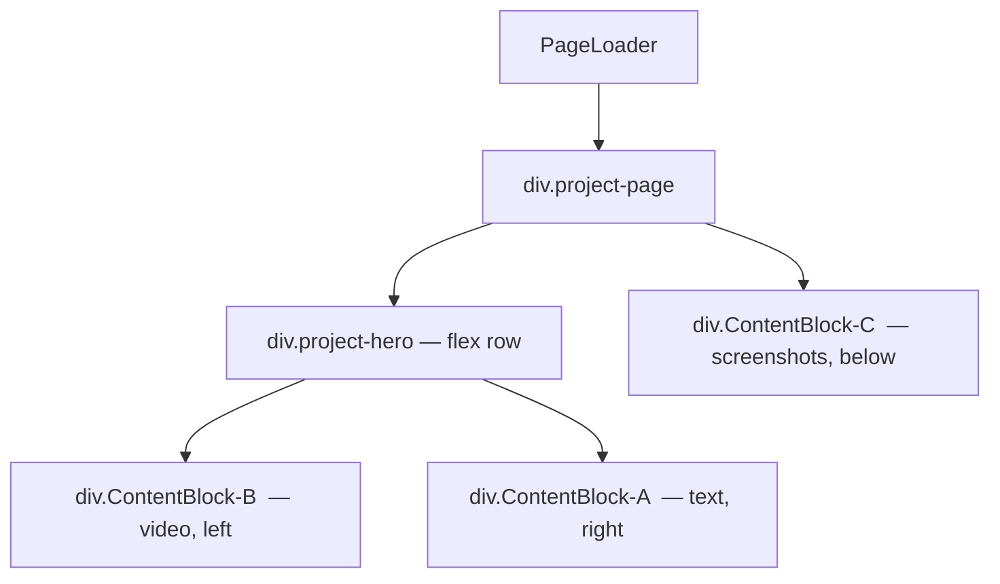
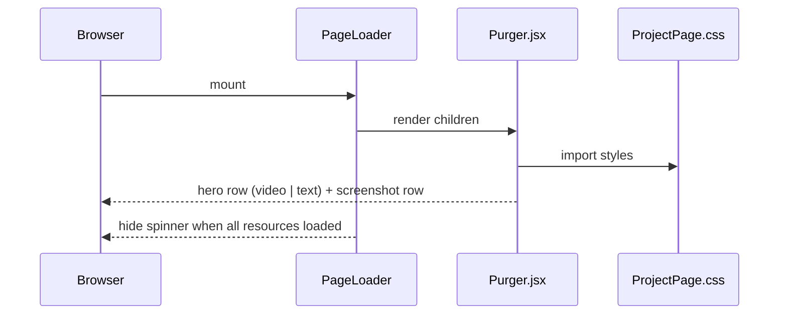

# Design Document: Purger Layout Redesign

## Overview

Redesign the Purger project page layout so the YouTube video and text content sit side-by-side (video left, text right), with any supplementary content (screenshots, links) stacked below in a separate row.

The layout styles are placed in a **shared** `src/css/ProjectPage.css` file so any project page can adopt the same two-zone layout by importing one file and using the same class names.

---

## Architecture

The page already has three named `div` blocks. The redesign maps those blocks to a two-zone layout:



- `ContentBlock-B` (video) and `ContentBlock-A` (text) are placed inside a new wrapper `div.project-hero` that uses `display: flex`.
- `ContentBlock-C` (screenshots) remains outside the flex row, naturally flowing beneath it.
- No changes to component APIs or XML content files are needed.
- Any future project page adopts the layout by importing `ProjectPage.css` and using the same `div` class names.

---

## Sequence: Page Render Flow



---

## Components and Interfaces

### Purger.jsx (modified)

**Purpose**: Project showcase page for Purger. Owns the layout structure.

**JSX structure**:
```jsx
<PageLoader>
  <div className="project-page">

    {/* Hero row: video left, text right */}
    <div className="project-hero">
      <div className="ContentBlock-B">   {/* video */}
        <YouTubeVideo ... />
      </div>
      <div className="ContentBlock-A">   {/* text */}
        <XMLFileRenderer ... />  {/* title */}
        <XMLFileRenderer ... />  {/* content */}
        <XMLFileRenderer ... />  {/* links */}
      </div>
    </div>

    {/* Extra content: screenshots below */}
    <div className="ContentBlock-C">
      <WebPageImage ... />  {/* ×4 */}
    </div>

  </div>
</PageLoader>
```

**Responsibilities**:
- Introduce `div.project-page` as the page root.
- Introduce `div.project-hero` as the flex row wrapper.
- Reorder `ContentBlock-B` (video) before `ContentBlock-A` (text) inside the hero row.
- Keep `ContentBlock-C` outside the hero row.

---

### ProjectPage.css (new shared file)

**Purpose**: Shared layout styles for all project showcase pages. Any project page imports this single file to get the two-zone layout.

**Reuse pattern**: A future project page (e.g. `DodgeWest.jsx`) simply imports `../../css/ProjectPage.css` and wraps its content blocks in `div.project-page` / `div.project-hero` / `div.ContentBlock-A` / `div.ContentBlock-B` / `div.ContentBlock-C` — no additional CSS needed.

**Interface** (class contracts):

| Class | Role |
|---|---|
| `.project-page` | Page root; centres content, sets max-width |
| `.project-hero` | Flex row; first child on left, second child on right |
| `.ContentBlock-B` | Left column (video); constrained width |
| `.ContentBlock-A` | Right column (text); grows to fill remaining space |
| `.ContentBlock-C` | Extra content row below hero; wraps items horizontally |

---

## Data Models

No new data models. Existing XML content files and image paths are unchanged.

---

## Key CSS Rules with Formal Specifications

### `.project-hero` — flex row

```css
.project-hero {
  display: flex;
  flex-direction: row;
  align-items: flex-start;
  gap: 2rem;
  margin-bottom: 2rem;
}
```

**Preconditions:**
- Contains exactly two direct children: `.ContentBlock-B` (left) and `.ContentBlock-A` (right).
- Both children are block-level elements.

**Postconditions:**
- `.ContentBlock-B` renders to the left of `.ContentBlock-A`.
- Both columns align at their top edges.
- A `2rem` gap separates them.

**Responsive invariant:**
- At `max-width: 768px`, `flex-direction` switches to `column` so the left block stacks above the right block.

---

### `.ContentBlock-B` — left column (video)

```css
.ContentBlock-B {
  flex: 0 0 auto;
  max-width: 560px;
  width: 100%;
}
```

**Postconditions:**
- Column does not grow beyond `560px`.
- Content inside fills the column width.

---

### `.ContentBlock-A` — right column (text)

```css
.ContentBlock-A {
  flex: 1 1 0;
  min-width: 280px;
  text-align: left;
}
```

**Postconditions:**
- Column grows to fill remaining horizontal space.
- Text is left-aligned.
- Minimum width prevents collapse below `280px` before the responsive breakpoint triggers.

---

### `.ContentBlock-C` — extra content row

```css
.ContentBlock-C {
  display: flex;
  flex-wrap: wrap;
  justify-content: center;
  gap: 1rem;
  margin-top: 1rem;
}
```

**Postconditions:**
- Items wrap onto new lines when the viewport is too narrow.
- Items are centred within the row.

---

## Algorithmic Pseudocode

### Layout Resolution Algorithm

```pascal
ALGORITHM resolveLayout(viewportWidth)
INPUT: viewportWidth in pixels
OUTPUT: applied flex-direction for .project-hero

BEGIN
  IF viewportWidth > 768 THEN
    heroFlexDirection ← "row"
    // left block | right block
  ELSE
    heroFlexDirection ← "column"
    // left block stacks above right block
  END IF

  APPLY heroFlexDirection TO .project-hero
END
```

**Postconditions:**
- `heroFlexDirection` is either `"row"` or `"column"`.
- The layout never shows the right block to the left of the left block.

---

## Example Usage

```jsx
// Purger.jsx — after redesign
// Renders:
// ┌─────────────────────────────────────────┐
// │  [  YouTube Video  ] │  Title           │
// │                      │  Description     │
// │                      │  Links           │
// ├─────────────────────────────────────────┤
// │  [img1]  [img2]  [img3]  [img4]         │
// └─────────────────────────────────────────┘

// DodgeWest.jsx — future reuse (import same CSS, same class names)
// ┌─────────────────────────────────────────┐
// │  [  YouTube Video  ] │  Title           │
// │                      │  Description     │
// ├─────────────────────────────────────────┤
// │  [img1]  [img2]  [img3]                 │
// └─────────────────────────────────────────┘
```

---

## Correctness Properties

1. `.ContentBlock-B` always renders to the left of `.ContentBlock-A` on viewports wider than 768px.
2. On viewports ≤ 768px, `.ContentBlock-B` renders above `.ContentBlock-A` (column direction).
3. `.ContentBlock-C` always renders below `.project-hero`, never beside it.
4. Text inside `.ContentBlock-A` is left-aligned.
5. No existing component APIs (`YouTubeVideo`, `XMLFileRenderer`, `WebPageImage`) are modified.
6. The `PageLoader` loading-spinner behaviour is unaffected by the layout change.
7. The shared `ProjectPage.css` contains no page-specific selectors — any project page can import it without side effects.

---

## Error Handling

| Scenario | Behaviour |
|---|---|
| XML content fails to load | `XMLFileRenderer` renders its own error state; layout is unaffected |
| YouTube iframe fails to load | `YouTubeVideo` fires `onError`, marks resource complete; layout is unaffected |
| Image fails to load | `WebPageImage` fires `onError`, marks resource complete; broken-image placeholder shown |
| Very narrow viewport (< 320px) | `min-width: 320px` on `body` (already in `index.css`) prevents layout collapse |

---

## Testing Strategy

### Unit Testing Approach

- Verify `Purger.jsx` renders `.project-hero` containing both `.ContentBlock-B` and `.ContentBlock-A` as siblings.
- Verify `.ContentBlock-C` is a sibling of `.project-hero`, not a child.
- Verify `.ContentBlock-B` appears before `.ContentBlock-A` in DOM order.

### Property-Based Testing Approach

Not applicable for a pure layout/CSS change. Visual correctness is validated via snapshot or manual review.

### Integration Testing Approach

- Render `Purger` inside a `LoadingTrackerContext` provider and confirm all `WebPageImage` and `YouTubeVideo` resources register and complete without errors.

---

## Performance Considerations

- No additional network requests; all assets already loaded.
- CSS flexbox layout is GPU-composited and has negligible performance impact.
- One shared CSS file is more cache-friendly than per-page duplicates.

---

## Security Considerations

- No new external resources or user inputs introduced.
- Existing `YouTubeVideo` iframe sandbox attributes are unchanged.

---

## Dependencies

- `Purger.jsx` — modified (new wrapper divs, reordered blocks, CSS import)
- `src/css/ProjectPage.css` — new shared file
- No changes to any shared component or context.
