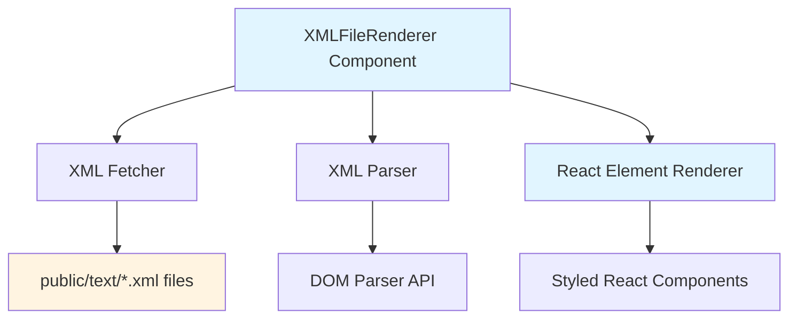
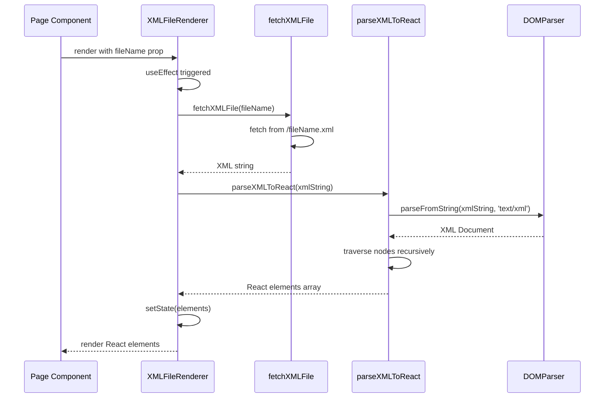

# Design Document: XML Content Renderer

## Overview

This design converts the existing TextFileRenderer component to an XML-based content rendering system (XMLFileRenderer). The current implementation uses plain text files with embedded HTML tags and dangerouslySetInnerHTML for rendering, which provides limited control over presentation and poses security risks. The new XML-based approach will parse structured XML content and render it as React components, providing better control over styling, structure, and security while maintaining the existing content management workflow.

## Architecture



## Sequence Diagrams

### XML Content Loading Flow



## Components and Interfaces

### Component 1: XMLFileRenderer

**Purpose**: Fetches XML content files and renders them as React components with proper styling and structure.

**Interface**:
```javascript
function XMLFileRenderer({ fileName, className })
```

**Props**:
- `fileName` (string, required): Path to XML file without extension (e.g., "text/Home/AboutMe")
- `className` (string, optional): CSS class to apply to the wrapper div

**Responsibilities**:
- Fetch XML file from public directory
- Parse XML content into React elements
- Handle loading and error states
- Render parsed content with proper styling

### Component 2: XML Parser Utility

**Purpose**: Converts XML DOM nodes to React elements recursively.

**Interface**:
```javascript
function parseXMLToReact(xmlString)
```

**Parameters**:
- `xmlString` (string): Raw XML content

**Returns**:
- Array of React elements

**Responsibilities**:
- Parse XML string using DOMParser
- Traverse XML nodes recursively
- Map XML tags to React components
- Preserve text content and attributes
- Handle whitespace and formatting

## Data Models

### XML Document Structure

```xml
<content>
  <paragraph>
    Text content with <bold>bold text</bold> and <italic>italic text</italic>
  </paragraph>
  <break />
  <heading level="2">Section Title</heading>
  <list type="unordered">
    <item>List item 1</item>
    <item>List item 2</item>
  </list>
  <link href="https://example.com">Link text</link>
</content>
```

**Supported XML Tags**:
- `<content>`: Root wrapper element
- `<paragraph>` or `<p>`: Paragraph text
- `<bold>` or `<b>`: Bold text
- `<italic>` or `<i>`: Italic text
- `<break>` or `<br>`: Line break
- `<heading level="1-6">`: Headings (h1-h6)
- `<list type="ordered|unordered">`: Lists (ol/ul)
- `<item>`: List items (li)
- `<link href="url">`: Hyperlinks (a)

**Validation Rules**:
- Root element must be `<content>`
- All tags must be properly closed
- `heading` must have valid `level` attribute (1-6)
- `list` must have valid `type` attribute (ordered/unordered)
- `link` must have `href` attribute

### Component State Model

```javascript
{
  content: Array<ReactElement> | null,  // Parsed React elements
  loading: boolean,                      // Loading state
  error: Error | null                    // Error state
}
```

## Key Functions with Formal Specifications

### Function 1: fetchXMLFile()

```javascript
async function fetchXMLFile(filepath)
```

**Preconditions:**
- `filepath` is a non-empty string
- `filepath` does not include file extension

**Postconditions:**
- Returns XML string if file exists and is valid
- Throws error if file not found or fetch fails
- No side effects on application state

**Loop Invariants:** N/A (no loops)

### Function 2: parseXMLToReact()

```javascript
function parseXMLToReact(xmlString)
```

**Preconditions:**
- `xmlString` is a valid XML string
- XML has proper structure with root element

**Postconditions:**
- Returns array of React elements
- All XML nodes are converted to corresponding React components
- Text content is preserved
- Attributes are mapped to React props
- Returns empty array if parsing fails

**Loop Invariants:**
- During node traversal: All previously processed nodes have been converted to valid React elements
- Node hierarchy is preserved in React element tree

### Function 3: convertNodeToReact()

```javascript
function convertNodeToReact(node, index)
```

**Preconditions:**
- `node` is a valid XML DOM Node
- `index` is a non-negative integer for React key

**Postconditions:**
- Returns React element corresponding to node type
- Text nodes return string content
- Element nodes return React components with children
- Unsupported nodes return null
- Recursive structure is maintained

**Loop Invariants:**
- During children processing: All processed children are valid React elements or null

## Algorithmic Pseudocode

### Main XML Fetching and Rendering Algorithm

```javascript
// XMLFileRenderer component algorithm
ALGORITHM renderXMLContent(fileName)
INPUT: fileName (string without extension)
OUTPUT: Rendered React elements

BEGIN
  // Initialize state
  state.content ← null
  state.loading ← true
  state.error ← null
  
  // Effect hook for fetching
  EFFECT on fileName change:
    TRY
      xmlString ← AWAIT fetchXMLFile(fileName + '.xml')
      reactElements ← parseXMLToReact(xmlString)
      state.content ← reactElements
      state.loading ← false
    CATCH error
      state.error ← error
      state.loading ← false
      console.error(error)
    END TRY
  END EFFECT
  
  // Render logic
  IF state.loading THEN
    RETURN <div>Loading...</div>
  ELSE IF state.error THEN
    RETURN <div>Error loading content</div>
  ELSE IF state.content THEN
    RETURN <div className={className}>{state.content}</div>
  ELSE
    RETURN null
  END IF
END
```

**Preconditions:**
- fileName is provided and non-empty
- XML file exists at specified path

**Postconditions:**
- Content is fetched and rendered, or error is displayed
- Loading state is properly managed
- Component re-renders on fileName change

**Loop Invariants:** N/A (async operation, no explicit loops)

### XML Parsing Algorithm

```javascript
ALGORITHM parseXMLToReact(xmlString)
INPUT: xmlString (valid XML string)
OUTPUT: Array of React elements

BEGIN
  // Parse XML string to DOM
  parser ← new DOMParser()
  xmlDoc ← parser.parseFromString(xmlString, 'text/xml')
  
  // Check for parsing errors
  parserError ← xmlDoc.querySelector('parsererror')
  IF parserError ≠ null THEN
    console.error('XML parsing error:', parserError.textContent)
    RETURN []
  END IF
  
  // Get root element
  root ← xmlDoc.documentElement
  
  // Convert root children to React elements
  reactElements ← []
  children ← root.childNodes
  
  FOR i ← 0 TO children.length - 1 DO
    ASSERT reactElements contains only valid React elements or null
    
    node ← children[i]
    element ← convertNodeToReact(node, i)
    
    IF element ≠ null THEN
      reactElements.push(element)
    END IF
  END FOR
  
  RETURN reactElements
END
```

**Preconditions:**
- xmlString is well-formed XML
- DOMParser is available in browser environment

**Postconditions:**
- Returns array of React elements
- Empty array if parsing fails
- All valid nodes are converted

**Loop Invariants:**
- All elements in reactElements are valid React elements or null
- Index i corresponds to current node being processed

### Node Conversion Algorithm

```javascript
ALGORITHM convertNodeToReact(node, index)
INPUT: node (XML DOM Node), index (integer for React key)
OUTPUT: React element or null

BEGIN
  // Handle text nodes
  IF node.nodeType = TEXT_NODE THEN
    text ← node.textContent.trim()
    IF text.length > 0 THEN
      RETURN text
    ELSE
      RETURN null
    END IF
  END IF
  
  // Handle element nodes
  IF node.nodeType = ELEMENT_NODE THEN
    tagName ← node.tagName.toLowerCase()
    attributes ← extractAttributes(node)
    
    // Recursively convert children
    children ← []
    FOR i ← 0 TO node.childNodes.length - 1 DO
      ASSERT children contains only valid React elements
      
      child ← convertNodeToReact(node.childNodes[i], i)
      IF child ≠ null THEN
        children.push(child)
      END IF
    END FOR
    
    // Map XML tag to React component
    reactElement ← mapTagToComponent(tagName, attributes, children, index)
    RETURN reactElement
  END IF
  
  // Ignore other node types
  RETURN null
END
```

**Preconditions:**
- node is a valid DOM Node
- index is non-negative integer

**Postconditions:**
- Returns React element for valid nodes
- Returns null for empty text or unsupported nodes
- Children are recursively processed

**Loop Invariants:**
- All elements in children array are valid React elements
- Node hierarchy is preserved

### Tag Mapping Algorithm

```javascript
ALGORITHM mapTagToComponent(tagName, attributes, children, key)
INPUT: tagName (string), attributes (object), children (array), key (integer)
OUTPUT: React element

BEGIN
  props ← { key: key, ...attributes }
  
  MATCH tagName WITH
    CASE 'paragraph' OR 'p':
      RETURN <p {...props}>{children}</p>
    
    CASE 'bold' OR 'b':
      RETURN <strong {...props}>{children}</strong>
    
    CASE 'italic' OR 'i':
      RETURN <em {...props}>{children}</em>
    
    CASE 'break' OR 'br':
      RETURN <br {...props} />
    
    CASE 'heading':
      level ← attributes.level OR 2
      HeadingTag ← 'h' + level
      RETURN <HeadingTag {...props}>{children}</HeadingTag>
    
    CASE 'list':
      ListTag ← attributes.type = 'ordered' ? 'ol' : 'ul'
      RETURN <ListTag {...props}>{children}</ListTag>
    
    CASE 'item':
      RETURN <li {...props}>{children}</li>
    
    CASE 'link':
      RETURN <a href={attributes.href} {...props}>{children}</a>
    
    DEFAULT:
      // Fallback for unsupported tags
      RETURN <span {...props}>{children}</span>
  END MATCH
END
```

**Preconditions:**
- tagName is non-empty string
- attributes is valid object
- children is array of React elements
- key is valid React key

**Postconditions:**
- Returns appropriate React element for tag
- All attributes are preserved as props
- Children are properly nested
- Unsupported tags fallback to span

**Loop Invariants:** N/A (no loops)

## Example Usage

### Example 1: Basic XMLFileRenderer Usage

```javascript
// In a page component (e.g., Home.jsx)
import XMLFileRenderer from "../components/XMLFileRenderer";

function Home() {
  return (
    <div className="home-page">
      <XMLFileRenderer fileName="text/Home/AboutMe" />
    </div>
  );
}
```

### Example 2: XML Content File

```xml
<!-- public/text/Home/AboutMe.xml -->
<content>
  <paragraph>
    I am Henry Kavadias-Barnes, Software Engineer, Game Design, and Gameplay Programmer. 
    I earned a double bachelor's degree from Swinburne University covering 
    <bold>Computer Science</bold> and <bold>Games and Interactivity</bold>.
  </paragraph>
  <break />
  <break />
  <paragraph>
    I'm passionate about games and applications that engage people, and enjoy 
    tackling complex technical and design challenges.
  </paragraph>
  <break />
  <break />
  <paragraph>
    I have played games for most of my life, discovering in my mid-teens that 
    I enjoy developing them as much as playing them. Since then I have pursued 
    a career in <bold>Software Development</bold> and <bold>Game Design</bold>.
  </paragraph>
</content>
```

### Example 3: Complex Content with Lists and Links

```xml
<!-- public/text/Purger/P_Content.xml -->
<content>
  <paragraph>
    A third person, 3D movement, Fast-paced, Possession, Gunship action game. 
    Each gunship has access to a different selection of weapons that they can 
    fire from a varying number of turrets.
  </paragraph>
  
  <paragraph>
    Development on this project is currently paused. I was mostly using it as 
    a learning experience to:
  </paragraph>
  
  <list type="unordered">
    <item>Apply my skills in programming and games design after graduating.</item>
    <item>Build on an interesting game prototype left over from a game jam.</item>
    <item>Experiment with scalable and modular design practices.</item>
  </list>
  
  <paragraph>
    Prototype Demo: <link href="https://fiddury.itch.io/purger">https://fiddury.itch.io/purger</link>
  </paragraph>
</content>
```

## Correctness Properties

*A property is a characteristic or behavior that should hold true across all valid executions of a system—essentially, a formal statement about what the system should do. Properties serve as the bridge between human-readable specifications and machine-verifiable correctness guarantees.*

### Property 1: XML Parsing Produces Valid React Elements

*For any* valid XML string, parsing should produce an array of React elements with non-negative length.

**Validates: Requirements 2.1, 2.2**

### Property 2: Hierarchy Preservation

*For any* XML element with child nodes, the parent-child relationships in the XML should be preserved in the resulting React element tree structure.

**Validates: Requirements 2.4, 8.2**

### Property 3: Text Content Preservation

*For any* XML document containing text nodes, all non-whitespace text content should appear in the rendered output.

**Validates: Requirements 2.5**

### Property 4: Whitespace Filtering

*For any* XML document containing whitespace-only text nodes, those nodes should be excluded from the rendered output.

**Validates: Requirements 2.6**

### Property 5: Malformed XML Handling

*For any* XML string containing parsing errors, the parser should return an empty array without crashing.

**Validates: Requirements 2.3, 7.2**

### Property 6: Attribute Preservation

*For any* XML element with attributes, all attributes should be preserved as React props in the converted element.

**Validates: Requirements 4.1, 6.4**

### Property 7: Heading Level Mapping

*For any* heading tag with a level attribute between 1 and 6, the parser should convert it to the corresponding React heading element (h1-h6).

**Validates: Requirements 3.5, 4.2**

### Property 8: Link Href Preservation

*For any* link tag with an href attribute, the parser should create a React anchor element with the href value preserved as a prop.

**Validates: Requirements 3.9, 4.3**

### Property 9: List Type Mapping

*For any* list tag with a type attribute of 'ordered' or 'unordered', the parser should render the corresponding ol or ul element.

**Validates: Requirements 4.4**

### Property 10: Unsupported Tag Fallback

*For any* XML tag that is not in the supported tags list, the parser should convert it to a safe React span element.

**Validates: Requirements 3.10, 6.3**

### Property 11: Recursive Child Processing

*For any* XML element with child nodes, all children should be recursively processed and included in the React element tree.

**Validates: Requirements 8.1**

### Property 12: Unique React Keys

*For any* set of sibling elements in the XML, each should be assigned a unique React key based on its position.

**Validates: Requirements 8.3**

### Property 13: Arbitrary Nesting Depth

*For any* valid XML structure with nested elements, the parser should successfully parse structures of arbitrary depth.

**Validates: Requirements 8.4**

### Property 14: Single-Pass Traversal

*For any* XML DOM tree, each node should be visited exactly once during parsing.

**Validates: Requirements 10.3**

### Property 15: Fetch Triggers on Mount

*For any* valid fileName prop, mounting the XMLFileRenderer component should trigger a fetch request to the correct file path with .xml extension.

**Validates: Requirements 1.1, 1.3, 11.3**

### Property 16: Fetch Triggers on Prop Change

*For any* change to the fileName prop, the XMLFileRenderer should trigger a new fetch request for the updated file.

**Validates: Requirements 1.2**

### Property 17: Loading State Display

*For any* fetch operation in progress, the XMLFileRenderer should display a loading indicator.

**Validates: Requirements 1.4, 5.1**

### Property 18: Error Handling Without Crashes

*For any* error condition (missing file, network failure, invalid XML), the XMLFileRenderer should display an error message and log to console without crashing the application.

**Validates: Requirements 1.5, 5.3, 9.1, 9.2, 9.3**

### Property 19: Error Logging

*For any* error that occurs during fetching or parsing, detailed error information should be logged to the console.

**Validates: Requirements 9.4**

### Property 20: Error Recovery

*For any* error state, changing the fileName prop should trigger a new fetch attempt and potentially recover from the error.

**Validates: Requirements 9.5**

### Property 21: Successful Content Rendering

*For any* successfully parsed XML content, the XMLFileRenderer should render the parsed React elements.

**Validates: Requirements 5.2**

### Property 22: ClassName Application

*For any* className prop provided to XMLFileRenderer, that className should be applied to the wrapper div element.

**Validates: Requirements 5.4**

### Property 23: Cleanup on Unmount

*For any* XMLFileRenderer component with a pending fetch operation, unmounting should clean up the operation without causing memory leaks or warnings.

**Validates: Requirements 5.5**

### Property 24: Content Escaping

*For any* XML content containing special characters, those characters should be automatically escaped in the rendered output through React's prop system.

**Validates: Requirements 6.2**

### Property 25: Idempotent Rendering

*For any* fileName, rendering the XMLFileRenderer multiple times with the same fileName should produce identical output without performance degradation.

**Validates: Requirements 10.4**

## Error Handling

### Error Scenario 1: File Not Found

**Condition**: XML file does not exist at specified path
**Response**: 
- Fetch promise rejects with 404 error
- Component catches error in useEffect
- Sets error state to true
**Recovery**: 
- Display user-friendly error message: "Error loading content"
- Log detailed error to console for debugging
- Component remains mounted and functional

### Error Scenario 2: Invalid XML Syntax

**Condition**: XML file contains malformed XML (unclosed tags, invalid characters)
**Response**:
- DOMParser detects parsing error
- parseXMLToReact checks for `parsererror` element
- Returns empty array
**Recovery**:
- Component renders empty content
- Error logged to console with details
- No crash or broken UI

### Error Scenario 3: Unsupported XML Tags

**Condition**: XML contains tags not in supported tag list
**Response**:
- mapTagToComponent falls through to default case
- Wraps content in generic `<span>` element
**Recovery**:
- Content still renders with basic styling
- Structure preserved
- Graceful degradation

### Error Scenario 4: Network Failure

**Condition**: Network request fails during fetch
**Response**:
- Fetch promise rejects with network error
- Component catches error and sets error state
**Recovery**:
- Display error message to user
- Component can retry on prop change
- No application crash

## Testing Strategy

### Unit Testing Approach

**Test Coverage Goals**: 90%+ coverage for core parsing logic

**Key Test Cases**:

1. **XML Parsing Tests**
   - Valid XML with all supported tags
   - Empty XML document
   - XML with only text content
   - Nested elements (3+ levels deep)
   - Mixed content (text + elements)

2. **Node Conversion Tests**
   - Text nodes with whitespace
   - Element nodes with attributes
   - Self-closing tags
   - Deeply nested structures
   - Edge case: empty elements

3. **Tag Mapping Tests**
   - Each supported tag type
   - Tags with attributes
   - Tags with children
   - Unsupported tags (fallback behavior)
   - Case sensitivity handling

4. **Component Tests**
   - Renders loading state initially
   - Renders content after successful fetch
   - Renders error state on fetch failure
   - Re-fetches on fileName prop change
   - Applies className prop correctly

**Testing Tools**: React Testing Library, Vitest (or Jest)

### Property-Based Testing Approach

**Property Test Library**: fast-check (JavaScript property-based testing)

**Properties to Test**:

1. **Parsing Idempotence**
   - Parsing the same XML string always produces the same React element structure
   - Test with randomly generated valid XML

2. **Round-trip Preservation**
   - Converting XML to React and back preserves content
   - Text content is never lost during conversion

3. **Hierarchy Preservation**
   - Parent-child relationships in XML match React element tree
   - Depth of nesting is preserved

4. **Attribute Preservation**
   - All XML attributes are converted to React props
   - Attribute values are unchanged

**Example Property Test**:
```javascript
import fc from 'fast-check';

test('parsing preserves text content', () => {
  fc.assert(
    fc.property(fc.string(), (text) => {
      const xml = `<content><paragraph>${text}</paragraph></content>`;
      const elements = parseXMLToReact(xml);
      const renderedText = extractTextContent(elements);
      return renderedText === text;
    })
  );
});
```

### Integration Testing Approach

**Integration Test Scenarios**:

1. **End-to-End Content Loading**
   - Mount XMLFileRenderer with real file path
   - Verify content loads and renders correctly
   - Check that styling is applied

2. **Multiple Component Instances**
   - Render multiple XMLFileRenderer components simultaneously
   - Verify no state interference between instances
   - Check independent loading states

3. **Dynamic Content Updates**
   - Change fileName prop
   - Verify old content is replaced
   - Check loading state transitions

4. **Error Recovery Flow**
   - Load invalid file
   - Verify error display
   - Change to valid file
   - Verify recovery and correct rendering

## Performance Considerations

### Optimization Strategies

1. **Memoization**
   - Memoize parseXMLToReact function to avoid re-parsing unchanged XML
   - Use React.memo for XMLFileRenderer if parent re-renders frequently

2. **Lazy Loading**
   - Content is only fetched when component mounts
   - No prefetching of unused content files

3. **Efficient DOM Traversal**
   - Single-pass recursive traversal of XML DOM
   - No redundant node visits
   - Early termination for empty text nodes

4. **React Key Optimization**
   - Use stable keys (index-based) for list rendering
   - Prevents unnecessary re-renders of unchanged elements

### Performance Targets

- XML parsing: < 50ms for typical content files (< 10KB)
- Component render: < 100ms from mount to content display
- Memory: < 1MB per component instance
- No memory leaks on unmount

### Scalability Considerations

- Current implementation suitable for files up to 100KB
- For larger files, consider streaming parser or chunked rendering
- Cache parsed results if same file loaded multiple times

## Security Considerations

### Security Improvements Over Current Implementation

1. **Elimination of dangerouslySetInnerHTML**
   - Current implementation uses dangerouslySetInnerHTML, which is vulnerable to XSS attacks
   - New implementation renders React elements directly, preventing script injection

2. **Controlled Tag Whitelist**
   - Only explicitly supported XML tags are rendered
   - Unknown tags fallback to safe `<span>` elements
   - No arbitrary HTML execution

3. **Attribute Sanitization**
   - Attributes are passed as React props, which are automatically escaped
   - href attributes in links should be validated (future enhancement)

### Security Best Practices

1. **Input Validation**
   - Validate XML structure before rendering
   - Reject files with suspicious content patterns
   - Limit file size to prevent DoS

2. **Content Security Policy**
   - Ensure CSP headers prevent inline script execution
   - Restrict external resource loading

3. **Link Validation** (Future Enhancement)
   - Validate href attributes to prevent javascript: URLs
   - Consider adding rel="noopener noreferrer" to external links

### Threat Model

**Threats Mitigated**:
- XSS via malicious HTML in content files
- Script injection through event handlers
- DOM-based attacks

**Remaining Considerations**:
- Content files are trusted (stored in public directory)
- No user-generated XML content
- Admin-controlled content updates only

## Dependencies

### Runtime Dependencies

- **React 19.2.0**: Core framework for component rendering
- **DOMParser (Browser API)**: Native XML parsing (no external library needed)

### Development Dependencies

- **Vite 7.2.4**: Build tool and dev server
- **ESLint**: Code linting
- **React Testing Library**: Component testing
- **Vitest** (or Jest): Test runner
- **fast-check**: Property-based testing library

### No Additional Dependencies Required

The implementation uses native browser APIs (DOMParser, fetch) and existing project dependencies. No new npm packages need to be installed for core functionality.

## Migration Strategy

### Phase 1: Component Implementation
1. Create XMLFileRenderer component
2. Implement XML parsing utilities
3. Add unit tests

### Phase 2: Content Migration
1. Convert existing .txt files to .xml format
2. Wrap content in `<content>` root element
3. Replace HTML tags with XML equivalents:
   - `<b>` → `<bold>`
   - `<br>` → `<break>`
   - Plain text → `<paragraph>`

### Phase 3: Component Replacement
1. Update imports in page components
2. Replace TextFileRenderer with XMLFileRenderer
3. Test each page individually

### Phase 4: Cleanup
1. Remove old TextFileRenderer component
2. Delete old .txt files
3. Update documentation

### Backward Compatibility

During migration, both components can coexist:
- Keep TextFileRenderer for .txt files
- Use XMLFileRenderer for new .xml files
- Gradual migration page by page
