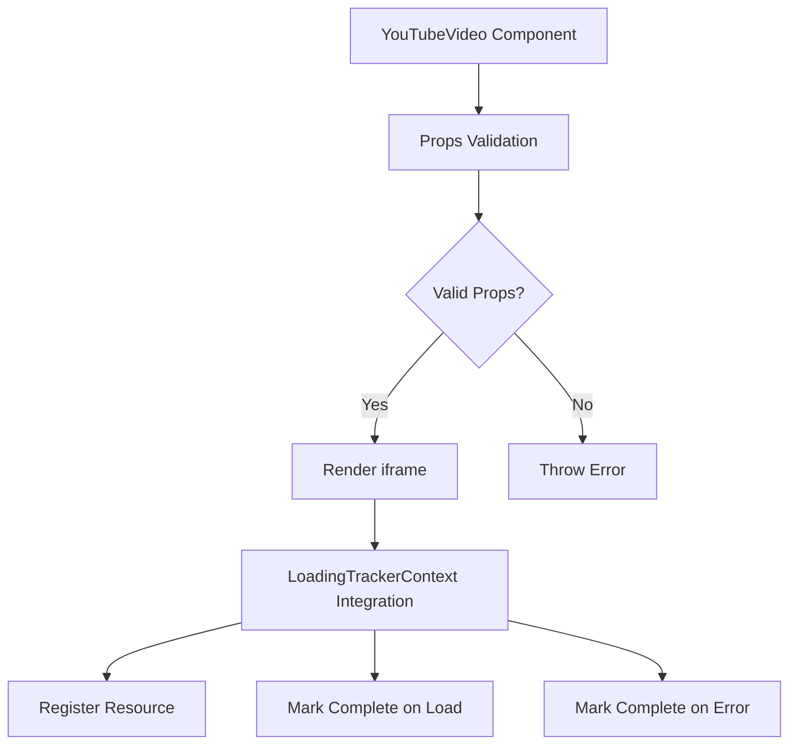
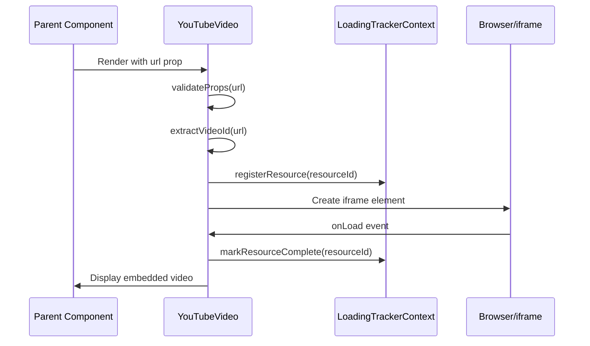

# Design Document: YouTube Video Component

## Overview

A reusable React component for embedding YouTube videos throughout the portfolio website. The component accepts a full YouTube URL and optional configuration parameters (width, height, title), extracts the video ID from the URL, and renders an iframe with the embedded video. It follows the project's existing patterns for prop validation, error handling, and loading tracking integration.

## Architecture



## Main Algorithm/Workflow



## Components and Interfaces

### YouTubeVideo Component

**Purpose**: Embed YouTube videos with consistent styling and loading tracking

**Interface**:
```javascript
function YouTubeVideo({ 
  url,                   // Required: Full YouTube URL (e.g., "https://www.youtube.com/watch?v=dQw4w9WgXcQ")
  width = 560,           // Optional: iframe width in pixels
  height = 315,          // Optional: iframe height in pixels
  title = "YouTube video player",  // Optional: iframe title for accessibility
  trackLoading = true    // Optional: whether to integrate with LoadingTrackerContext
})
```

**Responsibilities**:
- Validate that url prop is provided and non-empty
- Extract video ID from various YouTube URL formats
- Construct proper YouTube embed URL from extracted video ID
- Render iframe with appropriate attributes (allow, allowFullScreen, frameBorder)
- Integrate with LoadingTrackerContext for page loading coordination
- Handle iframe load and error events
- Apply consistent styling

## Data Models

### Props Model

```javascript
{
  url: string,               // Required, non-empty, valid YouTube URL
  width: number,             // Optional, default 560
  height: number,            // Optional, default 315
  title: string,             // Optional, default "YouTube video player"
  trackLoading: boolean      // Optional, default true
}
```

**Validation Rules**:
- url must be provided (not null, undefined, or empty string)
- url must be a valid YouTube URL format
- width and height must be positive numbers if provided
- title should be descriptive for screen readers

### Supported YouTube URL Formats

The component supports extracting video IDs from these URL formats:

```javascript
// Standard watch URL
"https://www.youtube.com/watch?v=dQw4w9WgXcQ"
"http://www.youtube.com/watch?v=dQw4w9WgXcQ"

// Short URL
"https://youtu.be/dQw4w9WgXcQ"
"http://youtu.be/dQw4w9WgXcQ"

// Embed URL
"https://www.youtube.com/embed/dQw4w9WgXcQ"
"http://www.youtube.com/embed/dQw4w9WgXcQ"

// With additional query parameters
"https://www.youtube.com/watch?v=dQw4w9WgXcQ&t=30s"
"https://youtu.be/dQw4w9WgXcQ?t=30"
```

### YouTube Embed URL Format

```javascript
`https://www.youtube.com/embed/${videoId}`
```

## Key Functions with Formal Specifications

### Function 1: validateProps()

```javascript
function validateProps(url)
```

**Preconditions:**
- url parameter is provided (may be null/undefined/empty, validation will check)

**Postconditions:**
- If url is falsy or empty string, throws Error with message "YouTubeVideo requires a 'url' prop"
- If url is valid, function completes without throwing
- No side effects on input parameters

**Loop Invariants:** N/A (no loops)

### Function 2: extractVideoId()

```javascript
function extractVideoId(url)
```

**Preconditions:**
- url is a non-empty string
- url has been validated by validateProps()

**Postconditions:**
- Returns video ID string if URL matches supported YouTube formats
- Returns null if URL format is not recognized
- Handles standard watch URLs (youtube.com/watch?v=ID)
- Handles short URLs (youtu.be/ID)
- Handles embed URLs (youtube.com/embed/ID)
- Strips query parameters and extracts only the video ID
- No side effects on input parameters

**Loop Invariants:** N/A (no loops)

### Function 3: constructEmbedUrl()

```javascript
function constructEmbedUrl(videoId)
```

**Preconditions:**
- videoId is a non-empty string
- videoId has been extracted by extractVideoId()

**Postconditions:**
- Returns string in format `https://www.youtube.com/embed/${videoId}`
- Return value is a valid YouTube embed URL
- No side effects on input parameters

**Loop Invariants:** N/A (no loops)

### Function 4: handleIframeLoad()

```javascript
function handleIframeLoad()
```

**Preconditions:**
- Component is mounted
- LoadingTrackerContext is available (if trackLoading is true)
- resourceId has been registered with context

**Postconditions:**
- Sets iframeLoaded state to true
- Calls context.markResourceComplete(resourceId) if trackLoading is enabled
- State update triggers re-render

**Loop Invariants:** N/A (no loops)

### Function 5: handleIframeError()

```javascript
function handleIframeError()
```

**Preconditions:**
- Component is mounted
- LoadingTrackerContext is available (if trackLoading is true)
- resourceId has been registered with context

**Postconditions:**
- Sets iframeLoaded state to true (to unblock page loading)
- Calls context.markResourceComplete(resourceId) if trackLoading is enabled
- Logs error to console for debugging
- State update triggers re-render

**Loop Invariants:** N/A (no loops)

## Algorithmic Pseudocode

### Main Component Rendering Algorithm

```javascript
ALGORITHM renderYouTubeVideo(props)
INPUT: props = { url, width, height, title, trackLoading }
OUTPUT: React element (iframe) or Error

BEGIN
  // Step 1: Validate required props
  ASSERT url is non-empty string
  validateProps(url)
  
  // Step 2: Extract video ID from URL
  videoId ← extractVideoId(url)
  IF videoId is null THEN
    THROW Error("Invalid YouTube URL format")
  END IF
  
  // Step 3: Initialize state and context
  context ← useContext(LoadingTrackerContext)
  resourceId ← useRef(`youtube-${videoId}-${random()}`).current
  iframeLoaded ← useState(false)
  iframeLoadedRef ← useRef(false)
  
  // Step 4: Register with loading tracker on mount
  useEffect(() => {
    IF trackLoading AND context exists THEN
      context.registerResource(resourceId)
    END IF
    
    // Cleanup on unmount
    RETURN cleanup function:
      IF trackLoading AND context exists AND NOT iframeLoadedRef.current THEN
        context.markResourceComplete(resourceId)
      END IF
  }, [trackLoading, context, resourceId])
  
  // Step 5: Construct embed URL
  embedUrl ← constructEmbedUrl(videoId)
  
  // Step 6: Render iframe with event handlers
  RETURN iframe element with:
    - src = embedUrl
    - width = width
    - height = height
    - title = title
    - onLoad = handleIframeLoad
    - onError = handleIframeError
    - allow = "accelerometer; autoplay; clipboard-write; encrypted-media; gyroscope; picture-in-picture"
    - allowFullScreen = true
    - frameBorder = "0"
END
```

**Preconditions:**
- props.url is provided and non-empty
- React hooks are available (component is functional component)
- LoadingTrackerContext is properly configured in app

**Postconditions:**
- Returns valid React iframe element
- Resource is registered with LoadingTrackerContext (if enabled)
- Cleanup function is registered for unmount
- iframe will trigger load/error handlers when ready

**Loop Invariants:** N/A (no loops in main algorithm)

### Validation Algorithm

```javascript
ALGORITHM validateProps(url)
INPUT: url (any type)
OUTPUT: void or Error

BEGIN
  // Check if url is provided and non-empty
  IF url is null OR url is undefined OR url === '' THEN
    THROW Error("YouTubeVideo requires a 'url' prop")
  END IF
  
  // Validation passed
  RETURN void
END
```

**Preconditions:**
- url parameter is provided (may be any type)

**Postconditions:**
- Throws Error if url is falsy or empty string
- Returns normally if url is valid
- No side effects on input

**Loop Invariants:** N/A (no loops)

### Video ID Extraction Algorithm

```javascript
ALGORITHM extractVideoId(url)
INPUT: url (validated string)
OUTPUT: videoId (string) or null

BEGIN
  // Try to match standard watch URL: youtube.com/watch?v=ID
  IF url contains "youtube.com/watch" THEN
    urlParams ← new URLSearchParams(url query string)
    videoId ← urlParams.get('v')
    IF videoId is not null THEN
      RETURN videoId
    END IF
  END IF
  
  // Try to match short URL: youtu.be/ID
  IF url contains "youtu.be/" THEN
    parts ← url.split("youtu.be/")
    IF parts.length > 1 THEN
      videoId ← parts[1].split(/[?&]/)[0]  // Remove query params
      IF videoId is not empty THEN
        RETURN videoId
      END IF
    END IF
  END IF
  
  // Try to match embed URL: youtube.com/embed/ID
  IF url contains "youtube.com/embed/" THEN
    parts ← url.split("youtube.com/embed/")
    IF parts.length > 1 THEN
      videoId ← parts[1].split(/[?&]/)[0]  // Remove query params
      IF videoId is not empty THEN
        RETURN videoId
      END IF
    END IF
  END IF
  
  // No valid format found
  RETURN null
END
```

**Preconditions:**
- url is a non-empty string
- url has passed validation

**Postconditions:**
- Returns video ID string if URL matches supported formats
- Returns null if no valid format is found
- Extracted video ID has query parameters removed
- No side effects on input

**Loop Invariants:** N/A (no loops)

### URL Construction Algorithm

```javascript
ALGORITHM constructEmbedUrl(videoId)
INPUT: videoId (validated string)
OUTPUT: embedUrl (string)

BEGIN
  baseUrl ← "https://www.youtube.com/embed/"
  embedUrl ← baseUrl + videoId
  
  ASSERT embedUrl starts with "https://www.youtube.com/embed/"
  ASSERT embedUrl contains videoId
  
  RETURN embedUrl
END
```

**Preconditions:**
- videoId is a non-empty string
- videoId has been extracted from valid URL

**Postconditions:**
- Returns properly formatted YouTube embed URL
- URL is safe for iframe src attribute
- No side effects on input

**Loop Invariants:** N/A (no loops)

## Example Usage

```javascript
// Example 1: Basic usage with standard YouTube URL
import YouTubeVideo from './components/YouTubeVideo';

function ProjectPage() {
  return (
    <div>
      <h1>My Game Trailer</h1>
      <YouTubeVideo url="https://www.youtube.com/watch?v=dQw4w9WgXcQ" />
    </div>
  );
}

// Example 2: Using short YouTube URL
function ProjectPage() {
  return (
    <div>
      <h1>Gameplay Video</h1>
      <YouTubeVideo url="https://youtu.be/dQw4w9WgXcQ" />
    </div>
  );
}

// Example 3: Custom dimensions with embed URL
function ProjectPage() {
  return (
    <div>
      <h1>Gameplay Video</h1>
      <YouTubeVideo 
        url="https://www.youtube.com/embed/dQw4w9WgXcQ" 
        width={800} 
        height={450}
        title="Gameplay demonstration"
      />
    </div>
  );
}

// Example 4: URL with query parameters (timestamp)
function ProjectPage() {
  return (
    <div>
      <h1>Specific Moment</h1>
      <YouTubeVideo url="https://www.youtube.com/watch?v=dQw4w9WgXcQ&t=30s" />
    </div>
  );
}

// Example 5: Without loading tracking (for non-critical content)
function ProjectPage() {
  return (
    <div>
      <h1>Bonus Content</h1>
      <YouTubeVideo 
        url="https://youtu.be/dQw4w9WgXcQ" 
        trackLoading={false}
      />
    </div>
  );
}

// Example 6: Multiple videos on same page
function ProjectPage() {
  return (
    <div>
      <h1>Video Gallery</h1>
      <YouTubeVideo url="https://www.youtube.com/watch?v=video1" title="Trailer" />
      <YouTubeVideo url="https://youtu.be/video2" title="Gameplay" />
      <YouTubeVideo url="https://www.youtube.com/embed/video3" title="Behind the Scenes" />
    </div>
  );
}

// Example 7: Error handling
function ProjectPage() {
  const videoUrl = getVideoUrlFromConfig(); // might be undefined
  
  if (!videoUrl) {
    return <p>No video available</p>;
  }
  
  return <YouTubeVideo url={videoUrl} />;
}
```

## Correctness Properties

### Property 1: Valid Props Requirement
**∀ component instances**: If url is null, undefined, or empty string, then component throws Error before rendering

### Property 2: Video ID Extraction Correctness
**∀ valid YouTube URLs**: extractVideoId(url) correctly extracts video ID from standard, short, and embed URL formats

### Property 3: URL Construction Correctness
**∀ valid videoId**: constructEmbedUrl(videoId) returns `https://www.youtube.com/embed/${videoId}`

### Property 4: URL Format Support
**∀ component instances**: Component correctly handles these URL formats:
- Standard: `https://www.youtube.com/watch?v=VIDEO_ID`
- Short: `https://youtu.be/VIDEO_ID`
- Embed: `https://www.youtube.com/embed/VIDEO_ID`
- With query parameters: URLs with `&t=30s` or other parameters

### Property 5: Loading Tracker Integration
**∀ component instances where trackLoading = true**: 
- Resource is registered on mount
- Resource is marked complete on iframe load OR error OR unmount
- Resource is never marked complete more than once

### Property 6: Cleanup Guarantee
**∀ component instances**: On unmount, if iframe has not loaded and trackLoading is enabled, resource is marked complete to prevent blocking page load

### Property 7: Accessibility
**∀ rendered iframes**: iframe has non-empty title attribute for screen reader compatibility

### Property 8: Security
**∀ rendered iframes**: iframe uses HTTPS protocol and includes proper allow attributes for YouTube embed features

### Property 9: Idempotency
**∀ component instances with same props**: Multiple renders with identical props produce identical iframe elements

## Error Handling

### Error Scenario 1: Missing url Prop

**Condition**: Component is rendered without url prop, or url is empty string
**Response**: Throw Error with message "YouTubeVideo requires a 'url' prop"
**Recovery**: Parent component should handle error boundary or provide valid url

### Error Scenario 2: Invalid URL Format

**Condition**: url prop is provided but doesn't match any supported YouTube URL format
**Response**: Throw Error with message "Invalid YouTube URL format"
**Recovery**: Parent component should provide valid YouTube URL in supported format

### Error Scenario 3: iframe Load Failure

**Condition**: YouTube iframe fails to load (network error, invalid video ID, video removed)
**Response**: 
- handleIframeError() is called
- Error is logged to console
- Resource is marked complete to unblock page loading
- iframe remains in DOM (YouTube will show its own error message)
**Recovery**: User sees YouTube's native error message in iframe; page continues to function

### Error Scenario 4: LoadingTrackerContext Not Available

**Condition**: Component is used outside of LoadingTrackerContext provider
**Response**: 
- context will be null/undefined
- Component checks for context existence before calling context methods
- Component renders normally without loading tracking
**Recovery**: Component functions normally, just without loading coordination

### Error Scenario 5: Component Unmounts Before Load

**Condition**: User navigates away before iframe finishes loading
**Response**: 
- useEffect cleanup function executes
- Checks iframeLoadedRef to see if load completed
- If not loaded, marks resource complete to prevent memory leak
**Recovery**: Automatic cleanup, no user-visible impact

## Testing Strategy

### Unit Testing Approach

Test the component in isolation using React Testing Library and Vitest:

**Key Test Cases**:
1. Renders iframe with correct src URL from extracted video ID
2. Throws error when url is missing
3. Throws error when url is empty string
4. Throws error when url format is invalid
5. Correctly extracts video ID from standard watch URL
6. Correctly extracts video ID from short URL (youtu.be)
7. Correctly extracts video ID from embed URL
8. Handles URLs with query parameters correctly
9. Applies default width and height when not provided
10. Applies custom width and height when provided
11. Sets correct title attribute
12. Includes required iframe attributes (allow, allowFullScreen, frameBorder)
13. Calls context.registerResource on mount when trackLoading is true
14. Calls context.markResourceComplete on iframe load
15. Calls context.markResourceComplete on iframe error
16. Does not interact with context when trackLoading is false
17. Cleans up resource on unmount if not loaded

**Coverage Goals**: 100% line coverage, 100% branch coverage

### Property-Based Testing Approach

Use fast-check for property-based testing:

**Property Test Library**: fast-check

**Properties to Test**:
1. **Video ID Extraction**: For any valid YouTube URL format, extractVideoId correctly extracts the video ID
2. **URL Construction**: For any valid non-empty string videoId, constructEmbedUrl produces URL starting with "https://www.youtube.com/embed/"
3. **Props Validation**: For any falsy or empty url, component throws error
4. **Invalid URL Format**: For any string that doesn't match YouTube URL patterns, component throws error
5. **Dimensions**: For any positive numbers width and height, iframe renders with those dimensions
6. **Loading Tracking**: For any boolean trackLoading value, component correctly enables/disables context integration
7. **Idempotency**: Rendering with same props multiple times produces same output

### Integration Testing Approach

Test component within actual page context:

**Integration Test Cases**:
1. Component works correctly within PageLoader wrapper
2. Multiple YouTubeVideo components on same page don't interfere
3. Component integrates properly with LoadingTrackerContext provider
4. Component works in different page routes (Home, project pages)
5. Component handles rapid mount/unmount cycles (navigation)

## Performance Considerations

- **Lazy Loading**: Consider adding loading="lazy" attribute to iframe for below-the-fold videos
- **Resource Registration**: Each component instance creates unique resourceId to avoid conflicts
- **Cleanup**: useEffect cleanup prevents memory leaks on unmount
- **Ref Usage**: iframeLoadedRef prevents stale closure issues in cleanup function
- **Minimal Re-renders**: Component only re-renders when props change or load state changes

## Security Considerations

- **HTTPS Only**: Embed URL uses HTTPS protocol to prevent mixed content warnings
- **YouTube Domain**: URL is hardcoded to youtube.com domain, preventing injection attacks
- **iframe Sandbox**: YouTube's iframe includes built-in sandboxing for security
- **Allow Attributes**: Explicitly specify allowed features (autoplay, encrypted-media, etc.)
- **URL Parsing**: Video ID extraction uses safe string parsing methods without eval or dynamic code execution

## Dependencies

**React Dependencies**:
- react (19.2.0): useContext, useEffect, useRef, useState hooks
- LoadingTrackerContext: Custom context for page loading coordination

**No External Dependencies**: Component uses native iframe element, no third-party YouTube libraries needed

**Browser Requirements**:
- Modern browser with iframe support
- JavaScript enabled
- Internet connection for YouTube content
